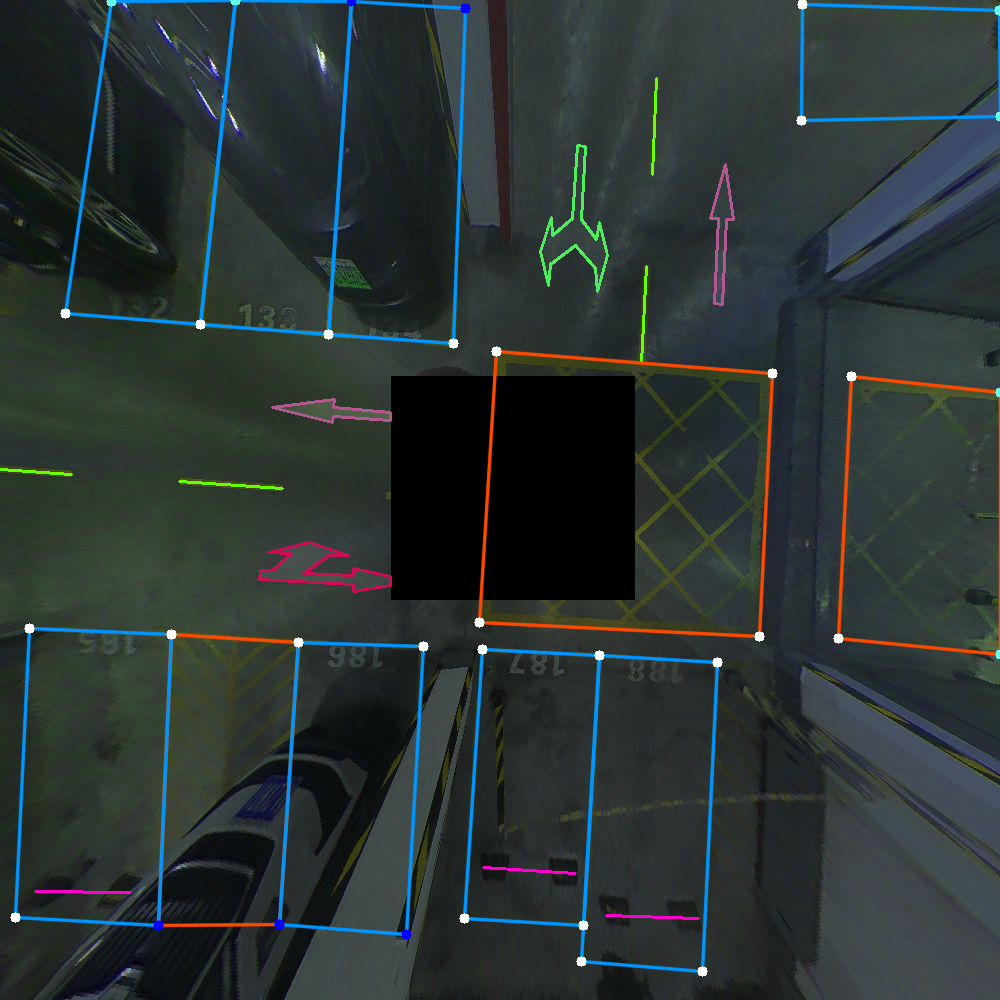
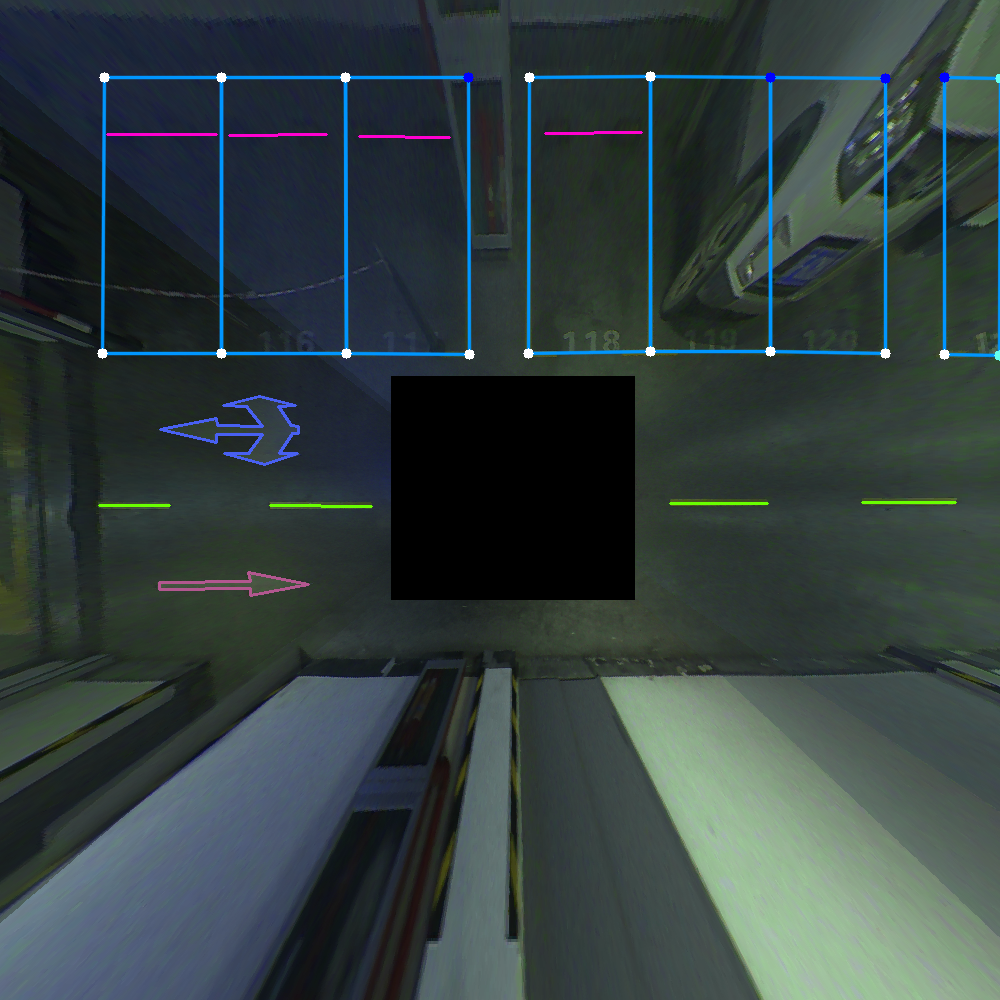
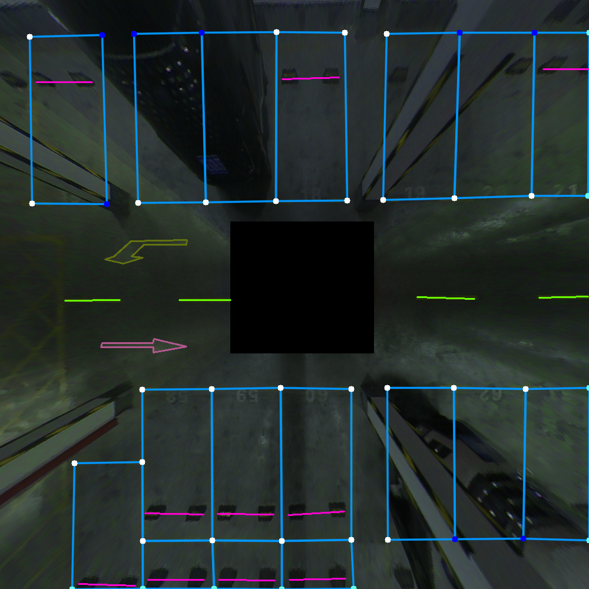
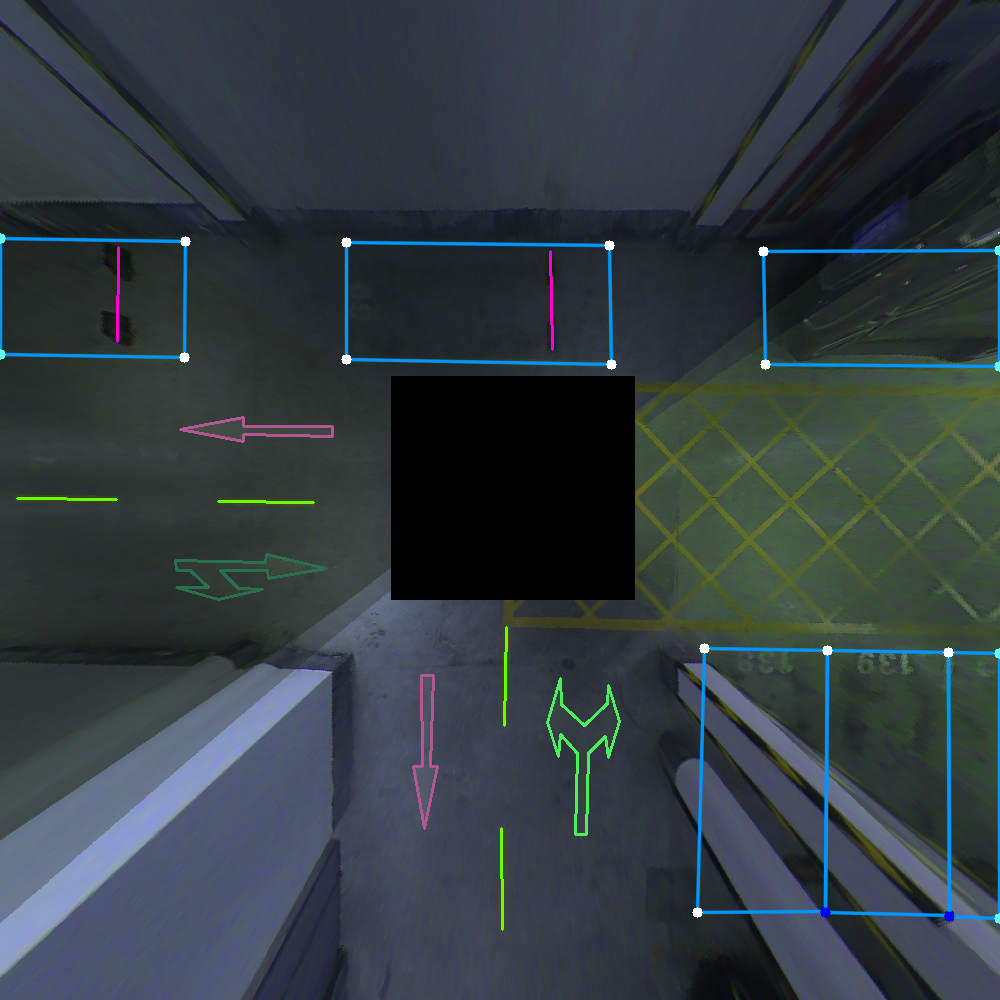
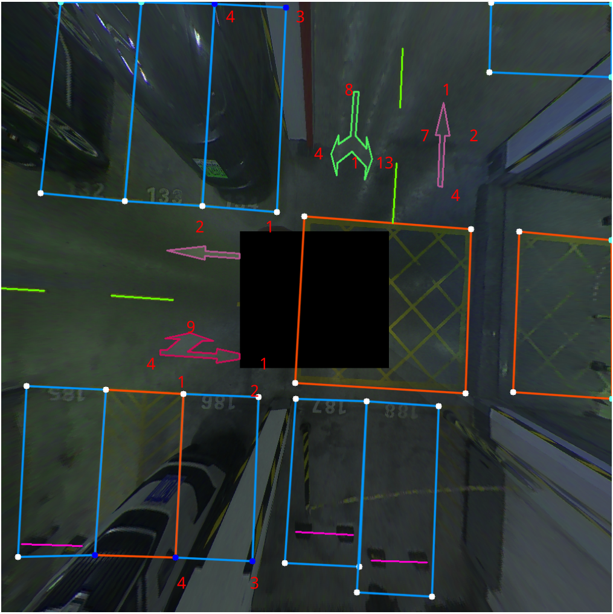
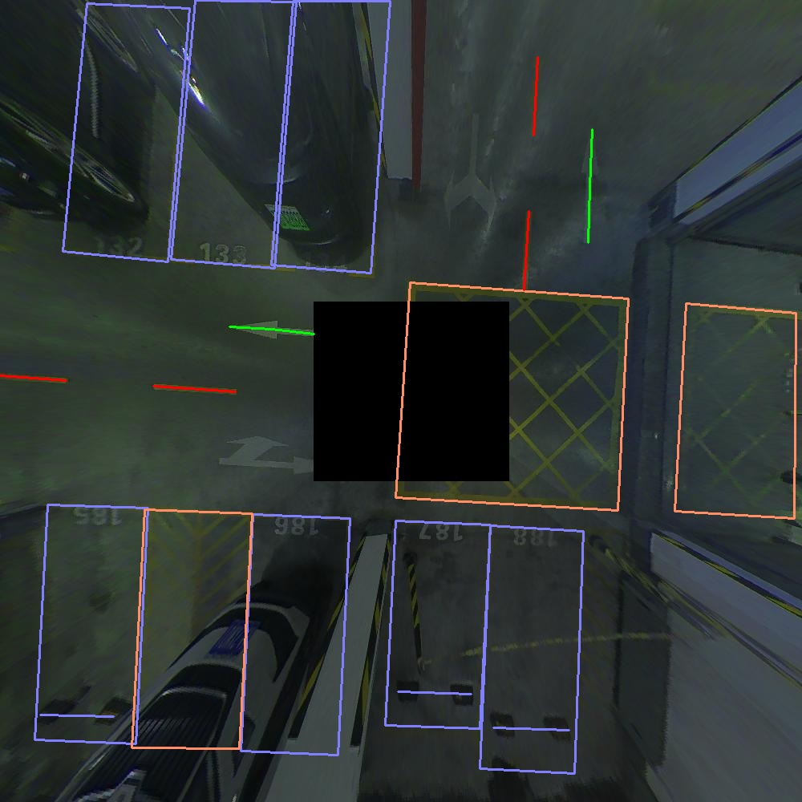
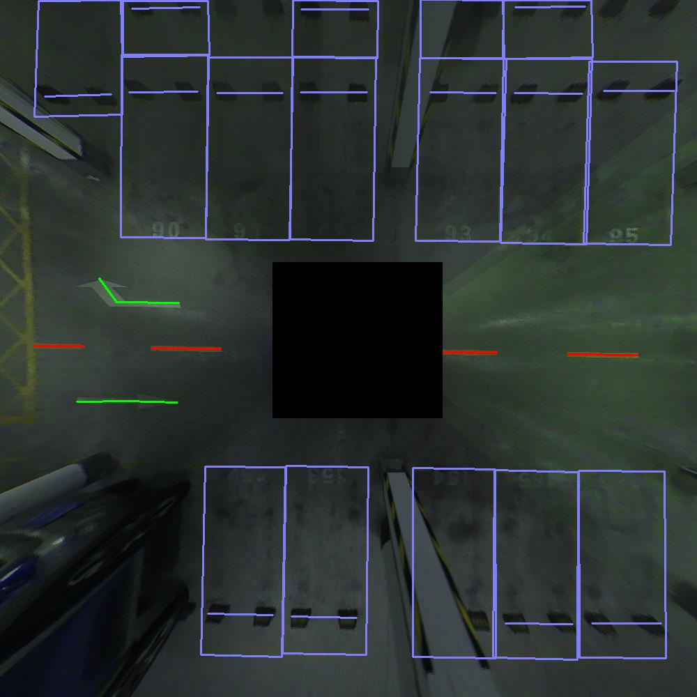
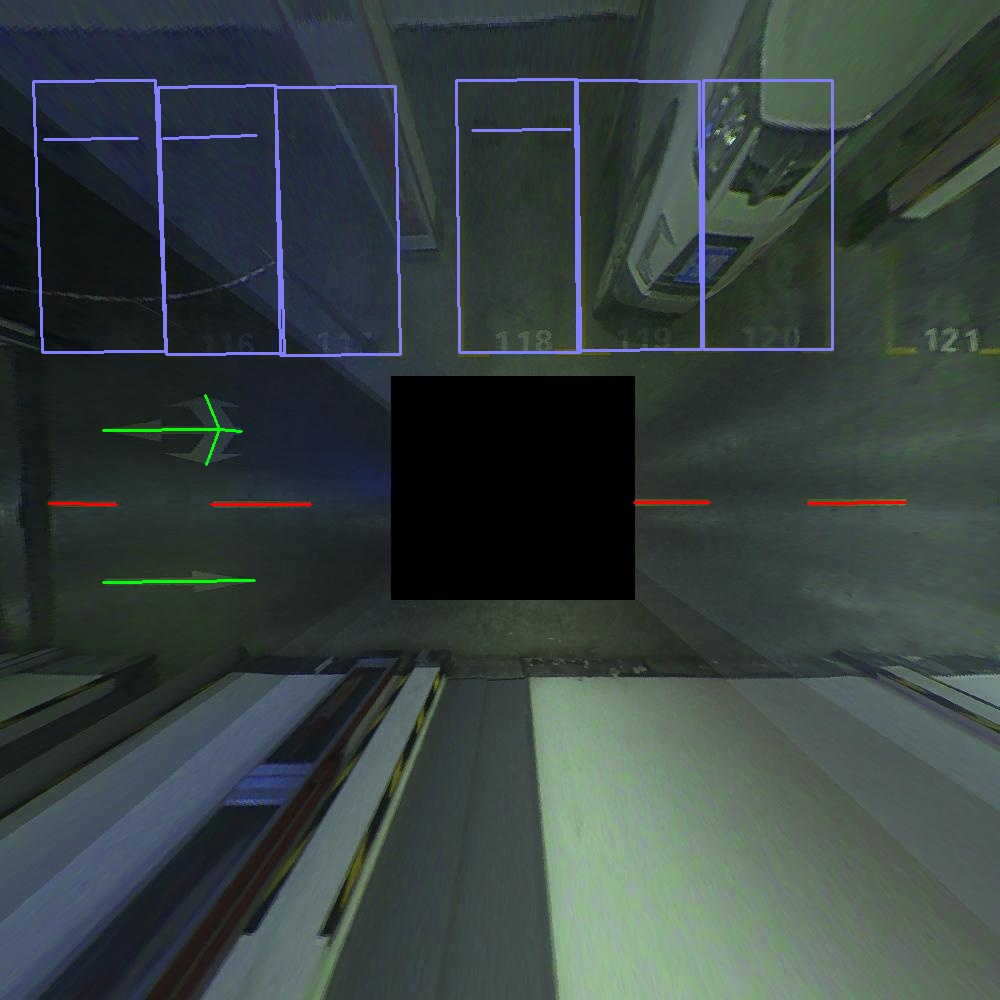
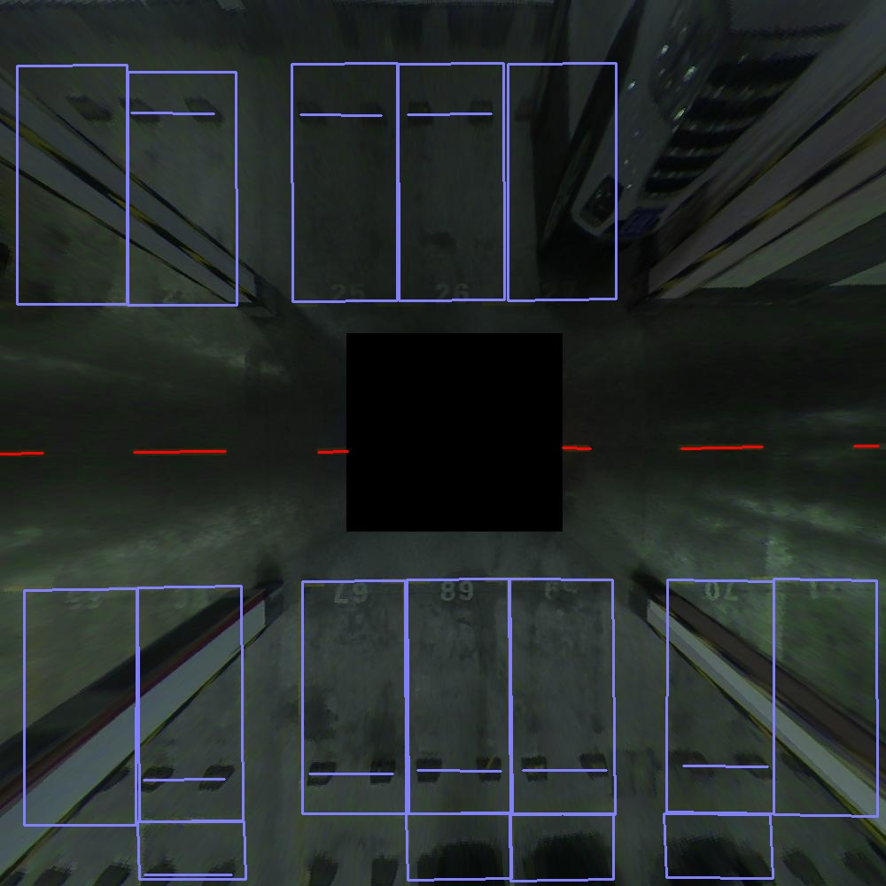

# RVD-UPL: A Real Vehicle Dataset of Underground Parking Lots for Autonomous Valet Parking

## Annotation example

<div align=center>


</div>

## Introduction

​	This dataset is an underground parking lot data set for autonomous valet parking tasks. It includes a ROS bag, 3K+ BEV(Bird's Eye View) picture, and the BEV picture is obtained by IPM(Inverse perspective Map). Supports the following tasks: visual SLAM, Lidar SLAM, semantic segmentation, semantic regression/point regression, depth estimation, parking spot detection, etc.

   The underground parking lot covers an area of approximately 50000 square meters, with over 250 parking spaces and a road length of approximately 1km. This scene includes walls, pillars, static vehicles, parking spaces, no parking area signs, speed bumps, arrows, lane lines, etc.

   We record the dataset using ROS bag format and provide annotated BEV images with five types of annotated elements: parking spaces, lane lines, no parking area signs, speed bumps, and arrows (a total of seven types of arrows). The sensors used to record the dataset include:

- 4x Fisheye cameras surround
- 1x IMU
- 1x LiDAR
- 1x Wheel Speed Encoder

## Data Organization

```bash
RVD-UPL
|  README.md
|  
⌊__BEV_picture
|  |0.png
|  |0.json
|  |1.png
|  |1.json
|  |...
⌊__bag_file
|  |all_avm_imu_pix_lidar_4.bag
⌊__config_file
|  |instances_train2017.json
|  |instances_val2017.json
⌊__Intrinsic_file
|  |0_intrinsic.yaml
|  |1_intrinsic.yaml
|  |2_intrinsic.yaml
|  |3_intrinsic.yaml
⌊__Extrinsic_file
|  |0_extrinsic.yaml
|  |1_extrinsic.yaml
|  |2_extrinsic.yaml
|  |3_extrinsic.yaml
⌊__Model_file
|  |model_last.pth
```

**Note: 0, 1, 2, and 3 respectively represent front view camera, rear view camera, left view camera, and right view camera. x_intrinic.yaml and x_extrinic.yaml represent the intrinsic and extrinsic files of the camera.**

## Annotation Details



The four corners and arrow contours of the parking space are labeled in the same order, as shown in the figure, and each parking space and arrow follow the same labeling order. At the same time, the corners of the parking space also have visible and invisible attributes.

## Download

**Data_link.txt**

## Semantic Regression

We use **Centernet** for example. Pretrained models are provided for test.

### Requirements

- opencv-python
- Cython
- numba
- progress
- matplotlib
- easydict
- scipy

Other requirements can be installed with `pip install -r requirements.txt`.

### **train**

I used the following command to train the models:

```python
if you have more gpus you can try more.
export CUDA_VISIBLE_DEVICES=0
python main.py ctdet --exp_id c --batch_size 64 --lr 2e-3
```

### Test

```python
python demo.py --load_model ../models/model_last.pth
```

## Regression Results

<div align=center>


</div>
note:  In order to reduce the storage capacity, the detection results of the arrows are represented only by skeleton points, and the output results of other elements are the same as when marked.
